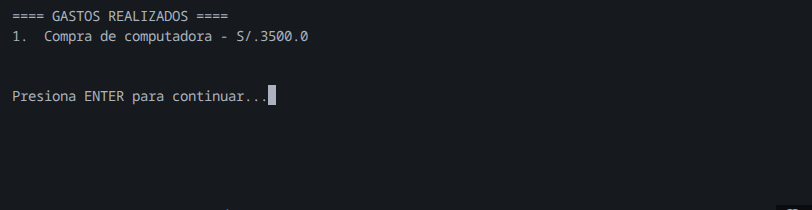
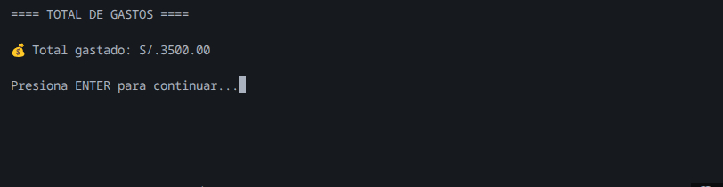
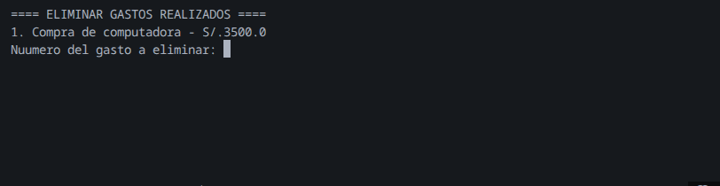

# 💰 Gestor de Gastos Personales

Aplicación de consola en Python para administrar gastos personales de forma simple y eficiente.

## 📸 Capturas de Pantalla

### Pantalla de Bienvenida


### Agregar Gasto


### Visualizar Gastos


### Calcular Total


### Eliminar Gasto


## 🚀 Características

- ✅ Agregar gastos con descripción y monto
- 📊 Visualizar todos los gastos registrados
- 💵 Calcular total acumulado
- 🗑️ Eliminar gastos individuales
- 🎯 Interfaz intuitiva en consola

## 🛠️ Tecnologías

- Python 3.x
- Sistema de menús interactivo con `match-case`
- Manejo de estructuras de datos (listas y diccionarios)

## 📦 Instalación
```bash
# Clona el repositorio
git clone https://github.com/eduardiazcode/Python/tree/221va4fde4f7bea225a3d31a82790762226089c/Proyectos_personales/gestor_gastos

# Navega al directorio
cd gastos_personales

# Ejecuta el programa
python gastos_personales.py
```

### Menú Principal
```
Seleccione una opcion:

1. Ingrese el gasto
2. Ver los gastos realizados
3. Calcular el gasto acumulado
4. Eliminar gasto
5. Salir
```

## 👨‍💻 Autor

Eduardo Díaz - [LinkedIn]www.linkedin.com/in/eduardodiazdev

## 📝 Licencia

Este proyecto es de código abierto y está disponible para fines educativos.